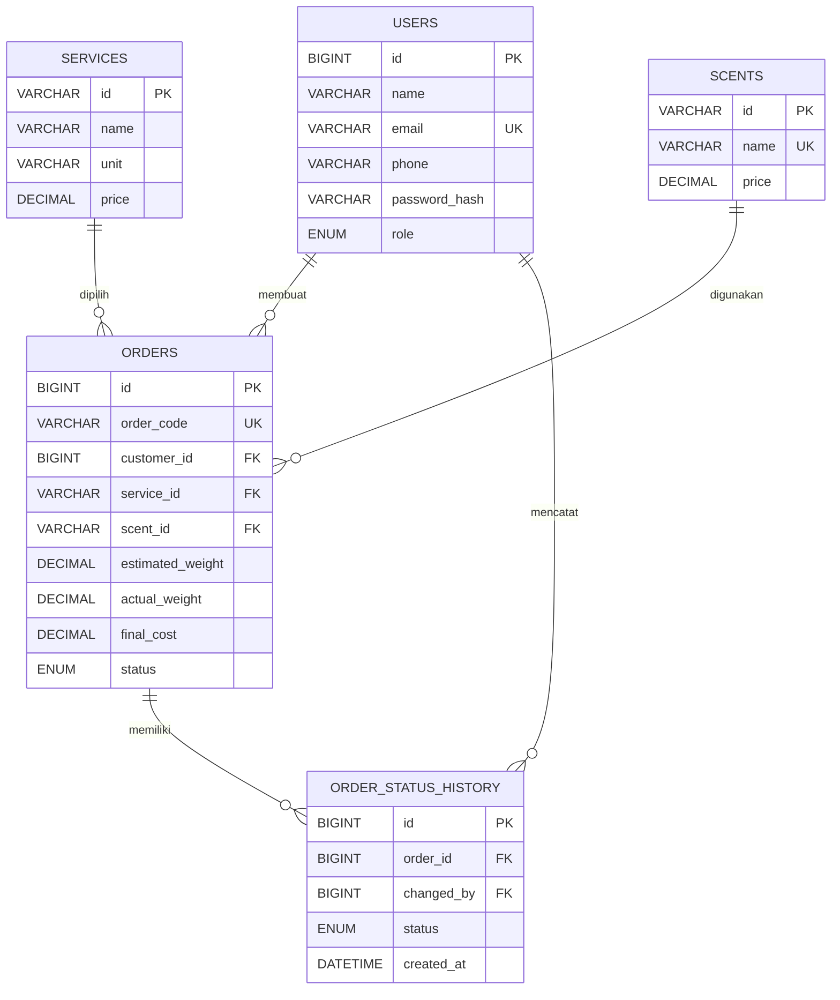

# ERD Database Washly

```mermaid
erDiagram
    USERS ||--o{ ORDERS : membuat
    SERVICES ||--o{ ORDERS : dipilih
    SCENTS ||--o{ ORDERS : digunakan
    ORDERS ||--o{ ORDER_STATUS_HISTORY : memiliki
    USERS ||--o{ ORDER_STATUS_HISTORY : mencatat

    USERS {
      BIGINT id PK
      VARCHAR name
      VARCHAR email UK
      VARCHAR phone
      VARCHAR password_hash
      ENUM role
    }
    SERVICES {
      VARCHAR id PK
      VARCHAR name
      VARCHAR unit
      DECIMAL price
    }
    SCENTS {
      VARCHAR id PK
      VARCHAR name UK
      DECIMAL price
    }
    ORDERS {
      BIGINT id PK
      VARCHAR order_code UK
      BIGINT customer_id FK
      VARCHAR service_id FK
      VARCHAR scent_id FK
      DECIMAL estimated_weight
      DECIMAL actual_weight
      DECIMAL final_cost
      ENUM status
    }
    ORDER_STATUS_HISTORY {
      BIGINT id PK
      BIGINT order_id FK
      BIGINT changed_by FK
      ENUM status
      DATETIME created_at
    }
```

Terdapat lima tabel yang berelasi melalui foreign key: `users`, `services`, `scents`, `orders`, dan `order_status_history`.
